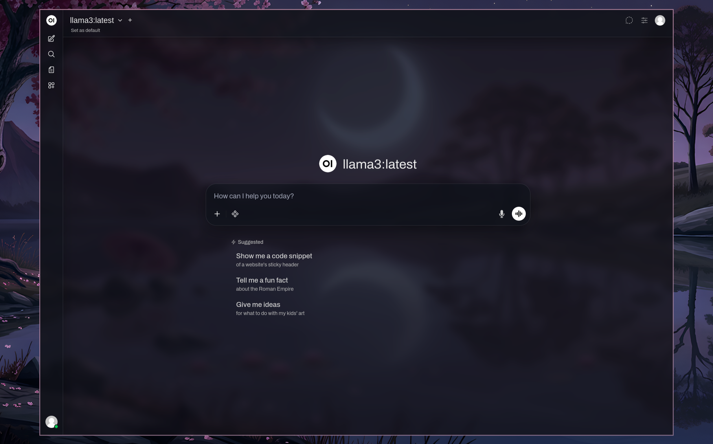

# Open WebUI Zen Transparency Style

A glass-morphic Stylus userstyle for Open WebUI in Zen Browser.



## Prerequisites

- Zen Browser
- Stylus extension
- Open WebUI running on `http://localhost:8080` or `http://localhost:3000`

## Installation

1. Open Stylus extension
2. Click "Create new style" 
3. Paste the contents of `open-webui-zen-transparency.user.css`
4. Click Save

## Supported URLs

```
http://localhost:8080
http://localhost:3000
https://localhost:8080
https://localhost:3000
```

## Customization

Edit CSS variables in `:root` to adjust transparency and blur:

```css
--owui-glass-bg: rgba(12, 16, 24, 0.42);      /* Main glass opacity */
--owui-glass-bg-strong: rgba(12, 16, 24, 0.62);  /* Stronger surfaces */
```

Change blur intensity: `blur(20px)` → `blur(12px)` (less) or `blur(28px)` (more)
